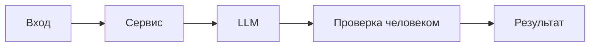

# ADR: решение для первого рабочего сценария

- Статус: proposed / accepted
- Дата: 2026-09-14
- Ответственные: команда бэкенда

## Контекст

Сервис ревью PR должен безопасно и стабильно проксировать diff во внешний LLM и возвращать нормализованный результат. В TRAINING_PR.diff отсутствуют защита секретов, лимит размера, таймаут и единый формат ответа.

## Решение

Добавить слой валидации и нормализации: проверка длины входа (API-1), редактирование секретов (SEC-1), обёртка вызова LLM с таймаутом 10 секунд и обработкой ошибок (REL-1), нормализация результата к схеме OUT-1. Логи ограничить по OBS-1.

## Рассмотренные альтернативы

| Альтернатива | Почему не выбрали сейчас |
|---|---|
| Перенос логики в фронтенд | Нельзя доверять клиенту для безопасности и правил |
| Отказ от нормализации результата | Ломаёт интеграции и проверяемость |
| Синхронное ожидание без таймаута | Риск подвисаний и истощения воркеров |

## Последствия и главный риск

- Положительные последствия:
  - Предсказуемое и безопасное поведение сервиса
  - Простые для автоматизации проверки
- Ограничения:
  - Дополнительная задержка на редактирование и проверку
- Главный риск:
  - Ложноположительная или ложноотрицательная редакция секретов
- Как проверим риск:
  - Набор тестовых секретов и e2e с инспекцией prompt

## Архитектурная схема

## Как использовали AI

- Для чего:
- Тип промпта:
- Строка в [`prompts.md`](prompts.md):
- Что проверили и исправили сами:
