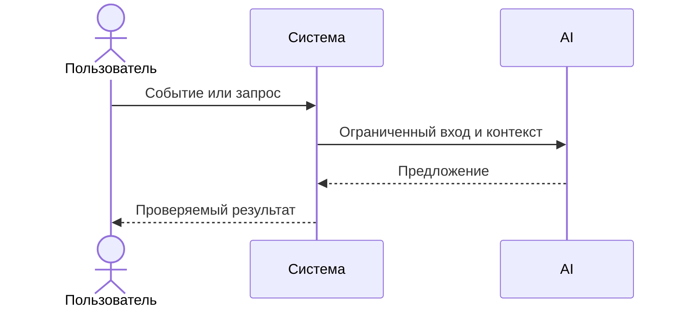

# Use cases и user stories

## Первый рабочий сценарий

**Когда** инженер отправляет diff на эндпоинт `/api/reviews`, **система** валидирует размер, редактирует секреты, вызывает LLM с таймаутом и возвращает нормализованный ответ OUT-1, **а пользователь получает** краткое summary, до трёх подтверждённых рисков и список проверок.

Не входит в этот сценарий:

- Автоматический approve/merge, генерация кода, любые действия в GitHub

## Use case

| Поле | Значение |
|---|---|
| Актор | Инженер-ревьюер |
| Триггер | POST `/api/reviews` с `diff` |
| Предусловия | Diff ≤ 20 000 символов |
| Основной результат | JSON: summary, risks≤3, checks |
| Ошибка или отказ | 413 при diff > 20k; контролируемый ответ при таймауте/ошибке LLM |



## User stories и acceptance criteria

```gherkin
Feature: Получение нормализованного ревью PR

  Scenario: Позитивный
    Given diff длиной 1000 символов без секретов
    When я отправляю POST /api/reviews
    Then я получаю 200 и JSON с полями summary, risks[], checks[] и не более 3 risks

  Scenario: Негативный или граничный
    Given diff длиной 25000 символов
    When я отправляю POST /api/reviews
    Then я получаю 413 и тело с объяснением ограничения
```

## Как использовали AI

- Для чего: описать сценарий и acceptance criteria по правилам кейса
- Тип промпта: structured prompting
- Строка в [`prompts.md`](prompts.md): P1-02
- Что проверили и исправили сами: проверили согласованность сценариев с OUT-1 и API-1
