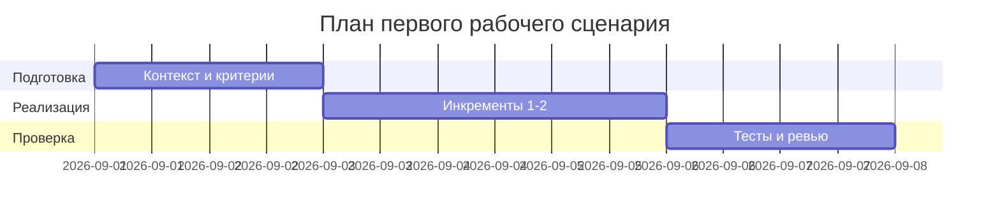

# План поставки

## Инкременты и ответственность

| Инкремент | Наблюдаемый результат | Что делает человек | Что делает AI или субагент | Проверка | Зависимости |
|---|---|---|---|---|---|
| 1 | Валидация размера diff и 413 | Формулирует критерии | Предлагает тестовые случаи | Интеграционные и e2e тесты | CASE.md API-1 |
| 2 | Редакция секретов (SEC-1) | Определяет маски | Генерирует паттерны и тесты | Юнит и e2e | CASE.md SEC-1 |
| 3 | Таймаут LLM 10с и graceful errors | Определяет формат ошибок | Подсказывает обработку исключений | Интеграционные тесты | CASE.md REL-1 |
| 4 | Формат OUT-1 | Утверждает схему | Генерирует контрактные тесты | Контрактные тесты | CASE.md OUT-1 |

## Диаграмма Ганта

Замените даты и задачи на свой план.

## Как использовали AI

- Для чего: разложить работу на инкременты и проверки
- Тип промпта: планирование
- Строка в [`prompts.md`](prompts.md): P1-02
- Что проверили и исправили сами: увязали проверки с соответствующими правилами
