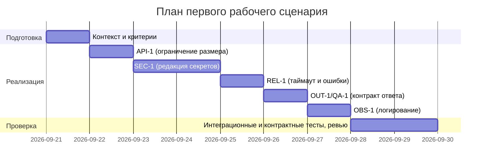

# Chain of Verification

- Проверяемый черновик или утверждение:
Аудит и исправление файла practices/practice_01/project_management.md относительно правил и ограничений из practices/practice_01/context.md.

## Запрос на проверку

Применить CoVe: выявить проблемы плана поставки (неполнота, непроверяемость, отсутствие трассировки), зафиксировать evidence, и внести минимальные правки в исправленную версию.

## Вопросы проверки и evidence

| Вопрос | Источник или проверка | Результат |
|---|---|---|
| Покрывает ли таблица инкрементов все правила CONTEXT (SEC-1, API-1, REL-1, OUT-1, QA-1, SCOPE-1, OBS-1)? | practices/practice_01/context.md L17–23 (перечень правил); practices/practice_01/project_management.md L7–10 (инкременты 1–4) | Покрыты API-1, SEC-1, REL-1, OUT-1; отсутствуют QA-1, SCOPE-1, OBS-1 |
| Достаточно ли конкретен «Наблюдаемый результат» для API-1 (порог длины diff и ожидаемый статус)? | practices/practice_01/project_management.md L7: «Валидация размера diff и 413» | Недостаточно: нет порога 20000, нет сценариев 19999/20001 |
| Есть ли конкретизация редакции секретов (что считается секретом, как выглядит результат [REDACTED])? | practices/practice_01/project_management.md L8: «Редакция секретов (SEC-1)» | Недостаточно: нет примера [REDACTED], нет перечня масок |
| Задан ли таймаут 10 с и формат контролируемого ответа при ошибках? | practices/practice_01/project_management.md L9: «Таймаут LLM 10с и graceful errors» | Частично: 10 с упомянут, формат контролируемого ответа не конкретизирован |
| Описан ли контракт OUT-1 и правило QA-1 (<=3 риска, структура, подтверждение evidence)? | practices/practice_01/context.md L20–22; practices/practice_01/project_management.md L10: «Формат OUT-1» | Частично: OUT-1 упомянут, QA-1 не отражён, отсутствуют условия отбрасывания лишних рисков |
| Чётко ли разделены роли «Человек» и «AI» и привязаны к наблюдаемым результатам? | practices/practice_01/project_management.md L7–10 (колонки «Что делает человек», «Что делает AI…») | Частично: роли описаны общо, без привязки к конкретным проверкам |
| Являются ли проверки проверяемыми/измеримыми (unit/integration/e2e с условиями и ожидаемыми исходами)? | practices/practice_01/project_management.md L7–10 (колонка «Проверка») | Недостаточно: указаны типы тестов без условий и ожидаемых результатов |
| Корректны ли зависимости (ссылки на правила/артефакты, порядок выполнения)? | practices/practice_01/project_management.md L7–10 (колонка «Зависимости») | Недостаточно: ссылки на CASE.md, нет явных зависимостей между инкрементами и CONTEXT |
| Реалистична ли диаграмма Ганта и отражает ли зависимости из таблицы? | practices/practice_01/project_management.md L14–26 (Mermaid) | Недостаточно: «Инкременты 1-2» объединены, даты общие, не отражают зависимостей, есть заглушка L26 |
| Учитывает ли план ограничение OBS-1 по логированию? | practices/practice_01/context.md L23; practices/practice_01/project_management.md (весь файл) | Отсутствует |
| Учитывает ли план ограничение SCOPE-1 (не действует в GitHub)? | practices/practice_01/context.md L21; practices/practice_01/project_management.md (весь файл) | Отсутствует |
| Корректен ли раздел «Как использовали AI» (цель, тип промпта, и ссылка на строку prompts.md для текущего эксперимента)? | practices/practice_01/project_management.md L28–33 | Некорректно для Практики 2: указано «P1-02», нужна строка P2-CoVe-01 |

## Исправленный результат

Ключевые изменения:
- Дополнены инкременты до полного покрытия CONTEXT: добавлены QA-1 и OBS-1, уточнён OUT-1, сохранён SCOPE-1 как ограничение.
- Конкретизированы наблюдаемые результаты (порог 20 000 символов; [REDACTED] для секретов; таймаут 10 с; схема JSON OUT-1; отсутствие утечек в логах).
- Проверки переведены в измеримые критерии приёмки (unit/integration/e2e/contract с условиями и ожидаемыми исходами).
- Зависимости привязаны к правилам CONTEXT и упорядочены.
- Диаграмма Ганта переработана: по шагам API-1 -> SEC-1 -> REL-1 -> OUT-1/QA-1 -> OBS-1 -> Проверка.
- Раздел «Как использовали AI» обновлён: цель CoVe, тип critique/CoVe, идентификатор «P2-CoVe-01».

## Что изменили в исходном артефакте

- Файл и раздел:
- practices/practice_02/chain_of_verification/project_management_fixed.md — весь документ
- Изменение:
- Уточнение инкрементов, проверок, зависимостей; добавление недостающих правил (QA-1, OBS-1); актуализация диаграммы Ганта; корректировка раздела «Как использовали AI».
- Что отклонили:
- Любые нетребуемые расширения функционала вне первого рабочего сценария; переписывание всего плана с нуля; добавление сложных новых процессов без связи с CONTEXT.

Скрытые рассуждения модели не сохраняйте; нужны только вопросы, evidence и исправленный результат.
## Промпт эксперимента

Chain of Verification: исправление project_management.md и журнал эксперимента

Роль

Вы — старший инженер-ревьюер, применяющий технику Chain of Verification (CoVe). Ваша задача: выявить все проблемы в артефакте Практики 1, исправить их минимальными корректными правками, зафиксировать ход проверки с evidence и обновить журнал экспериментов Практики 2. Скрытые рассуждения не сохраняйте — только вопросы проверки, evidence и итоговые артефакты.

Контекст и файлы

- Базовый артефакт для исправления: practices/practice_01/project_management.md
- Контекст кейса: practices/practice_01/CONTEXT.md
- Куда записать исправленный артефакт: practices/practice_02/chain_of_verification/project_management_fixed.md
- Шаблон эксперимента CoVe: practices/practice_02/chain_of_verification/experiment.md
- Журнал Практики 2: practices/practice_02/prompts.md
- Куда сохранить полный ответ: practices/practice_02/chain_of_verification/resp.md

Цель

- Найти все проблемы и несоответствия в practices/practice_01/project_management.md относительно CONTEXT.md и целей кейса; классифицировать проблемы; исправить документ минимальными, но достаточными правками.
- Зафиксировать процесс CoVe в experiment.md (вопросы проверки, источники/evidence, исправленный результат, что изменили/что отклонили).
- Заполнить строку «Chain of Verification» в practices/practice_02/prompts.md.

Процесс Chain of Verification

1) Сбор контекста
- Прочитайте полностью practices/practice_01/CONTEXT.md и practices/practice_01/project_management.md.
- Выпишите главные правила/ограничения из CONTEXT.md, влияющие на план (SEC-1, API-1, REL-1, OUT-1, SCOPE-1, QA-1, OBS-1; формат входа/выхода; ограничения).
- Зафиксируйте критерии «что считается хорошим» для project_management.md: конкретные инкременты, проверяемые результаты и проверки, трассировка на правила CONTEXT, реализуемые сроки/зависимости, реалистичная диаграмма Ганта, корректный раздел «Как использовали AI».

2) Вопросы проверки (Verification Questions)
- Сформулируйте исчерпывающий список вопросов (8–15) для аудита качества project_management.md. Покройте:
  - Полноту и конкретику таблицы «Инкременты»: наблюдаемые результаты, что делает человек/AI, проверки, зависимости.
  - Трассировку на правила CONTEXT (SEC-1, API-1, REL-1, OUT-1 и др.).
  - Проверяемость/измеримость колонок «Проверка» и «Наблюдаемый результат».
  - Реалистичность и связность диаграммы Ганта (даты, последовательности, зависимости).
  - Раздел «Как использовали AI»: цель, тип промпта, корректная ссылка/строка в prompts.md.
  - Отсутствие двусмысленностей, противоречий, недоказуемых требований.

3) Evidence по каждому вопросу
- Для каждого вопроса укажите источник и приведите evidence с цитатой и ссылкой на файл и номера строк, например: «project_management.md L7–10: …» или «CONTEXT.md: SEC-1 …».
- Если чего-то нет — это тоже evidence (отсутствие подтверждения в файлах).

4) Диагностика проблем
- Сопоставьте вопросы и evidence и составьте перечень проблем с классификацией:
  - Несоответствие CONTEXT (правил/ограничений)
  - Непроверяемо/неизмеримо
  - Двусмысленно/расплывчато
  - Нет трассировки/зависимости
  - Формальная/структурная ошибка
- Для каждой проблемы опишите минимальную правку, устраняющую её без лишней сложности.

5) Исправление артефакта (минимальные корректные изменения)
- Подготовьте полную обновлённую версию «План поставки» как practices/practice_02/chain_of_verification/project_management_fixed.md, сохранив структуру исходного файла (разделы и порядок), но:
  - Таблица «Инкременты и ответственность»: обновите так, чтобы каждый инкремент имел
    - конкретный наблюдаемый результат, привязанный к правилам CONTEXT (например, «diff > 20k — HTTP 413 (API-1)»),
    - чётко разделённые роли «Что делает человек» и «Что делает AI или субагент»,
    - проверку в форме конкретных тестов/критериев приёмки (unit/integration/e2e/contract) с условиями и ожидаемыми исходами,
    - зависимости с явной ссылкой на правило или артефакт (например, CASE.md, SEC-1, OUT-1),
    - не более необходимого количества инкрементов для первого рабочего сценария.
  - Диаграмма Ганта: реалистичные даты и продолжительности, отражающие зависимости из таблицы. Сохраняйте формат Mermaid; используйте близкие к текущей дате значения, но логичные (подготовка → реализация → проверка).
  - «Как использовали AI»: конкретизируйте цель применения, тип промпта, и укажите строку в practices/practice_02/prompts.md, относящуюся к этому CoVe-эксперименту (например, «P2-CoVe-01» — выберите и используйте единый идентификатор в обоих файлах).
- Не переписывайте документ с нуля; делайте минимальные правки, которых достаточно для соответствия CONTEXT и проверяемости.

6) Верификация правок
- Сверьте исправленный документ с перечнем проблем и правилами CONTEXT; убедитесь, что каждая проблема закрыта, а проверки выполнимы.

Что записать в файлы

1) practices/practice_02/chain_of_verification/project_management_fixed.md
- Полный исправленный документ «План поставки» с актуализированной таблицей инкрементов, диаграммой Ганта и разделом «Как использовали AI».
- Добавляйте только необходимые пояснения; избегайте воды и общих формулировок.

2) practices/practice_02/chain_of_verification/experiment.md
- Заполните поля шаблона:
  - «Проверяемый черновик или утверждение»: кратко опишите цель аудита (исправление project_management.md).
  - «Запрос на проверку»: сформулируйте задачу CoVe одной-двумя строками.
  - Таблица «Вопросы проверки и evidence»: внесите все вопросы из шага 2 и их evidence/результаты из шага 3.
  - «Исправленный результат»: краткое резюме ключевых изменений (не весь документ; сам документ — в project_management_fixed.md).
  - «Что изменили в исходном артефакте»: перечислите файл/раздел, изменение, что отклонили.
- Соблюдайте требование: не сохранять скрытые рассуждения, только вопросы, evidence и исправленный результат.

3) practices/practice_02/prompts.md
- Заполните верхние поля:
  - «Выбранный слабый артефакт Практики 1»: practices/practice_01/project_management.md
  - «Что в нём нужно улучшить»: перечислите ключевые проблемы, найденные CoVe.
  - «Как поймём, что изменение полезно»: конкретные критерии/метрики (тестируемость, трассировка, соответствие правилам, готовность к проверке).
- Заполните строку таблицы для «Chain of Verification» следующими значениями:
  - «Файл эксперимента»: [chain_of_verification/experiment.md]
  - «Изменённый файл Практики 1»: [practice_02/chain_of_verification/project_management_fixed.md] (исправленная версия исходного плана)
  - «Конкретное изменение»: 1–2 строки с квинтэссенцией внесённых правок
  - «Проверка»: как мы валидируем пользу (напр., «контрактные/интеграционные тесты сформулированы, критерии приёмки соответствуют OUT-1/REL-1/SEC-1/API-1»)
  - «Что отклонили»: перечислите идеи/правки, которые намеренно не внедряли
- В этом же файле зафиксируйте идентификатор строки (например, «P2-CoVe-01») и используйте его в разделе «Как использовали AI» исправленного плана.

- 4) practices/practice_02/chain_of_verification/resp.md
- Сохраните полную копию вашего финального ответа по этой задаче (тот же текст, который вы возвращаете пользователю/в сессию), без сокращений. Даже если файлы записаны напрямую, этот файл всё равно заполните для аудита.

Ограничения

- Минимизируйте изменения: меньше новых сущностей, только то, что нужно для соответствия CONTEXT и проверяемости.
- Пишите по-русски, конкретно, без общих слов. Избегайте двусмысленности.
- Не меняйте другие файлы, кроме указанных выше.
- Строго соблюдайте форматы Markdown и диаграммы Mermaid.

Формат вывода и запись файлов

- Если среда позволяет записывать файлы, сразу запишите все четыре файла по указанным путям.
- Если запись недоступна, верните содержимое в виде трёх последовательных блоков Markdown следующего вида, чтобы их можно было напрямую сохранить:

FILE: practices/practice_02/chain_of_verification/project_management_fixed.md
```md
...содержимое файла...
```

FILE: practices/practice_02/chain_of_verification/experiment.md
```md
...содержимое файла...
```

FILE: practices/practice_02/prompts.md
```md
...содержимое файла...
```

FILE: practices/practice_02/chain_of_verification/resp.md
```md
...полный текст вашего ответа...
```

Критерии приёмки

- Все выявленные проблемы в project_management.md отражены в experiment.md и закрыты в project_management_fixed.md.
- Исправленный план явно трассируется к правилам CONTEXT (SEC-1, API-1, REL-1, OUT-1, SCOPE-1, QA-1, OBS-1), проверки измеримы и выполнимы.
- Диаграмма Ганта консистентна с инкрементами и зависимостями.
- Строка «Chain of Verification» в practices/practice_02/prompts.md заполнена и согласована с разделом «Как использовали AI» в исправленном плане (единый идентификатор типа «P2-CoVe-01»).

## Исправленный файл

# План поставки

## Инкременты и ответственность

| Инкремент | Наблюдаемый результат | Что делает человек | Что делает AI или субагент | Проверка | Зависимости |
|---|---|---|---|---|---|
| 1 | При diff > 20000 символов возвращается HTTP 413 (API-1) | Формулирует границы и негативные кейсы (19999/20000/20001) | Генерирует шаблоны интеграционных тестов и фикстуры больших diff | Интеграционный: 20001 -> 413; Интеграционный: 19999 -> 200; E2E: клиент получает 413 с понятным сообщением | CONTEXT.md API-1; CASE.md |
| 2 | Перед вызовом LLM все секреты в diff заменены на [REDACTED] (SEC-1) | Утверждает список масок/паттернов | Предлагает паттерны и генерирует unit-тесты на редакцию | Unit: 'token=abc' -> '[REDACTED]'; Интеграция: построенный prompt не содержит 'abc' | CONTEXT.md SEC-1; API-1 |
| 3 | Внешний вызов LLM прерывается по таймауту 10 с; при ошибках возвращается контролируемый ответ без трасс-стека (REL-1) | Определяет контракт ошибок и временные бюджеты | Подсказывает обработку исключений и шаблоны ответов | Интеграция: заглушка спит 11 с -> контролируемый ответ; Unit: исключение провайдера -> нормализованный ответ | CONTEXT.md REL-1; SEC-1 |
| 4 | Ответ соответствует OUT-1: JSON с summary, risks[] (<=3: file,line,evidence,risk), checks; риски включаются только если подтверждены diff/правилом (QA-1) | Утверждает JSON-схему | Генерирует контрактные тесты | Контракт: валидация схемы; Негатив: 4-й риск отбрасывается; Позитив: риски содержат evidence из diff | CONTEXT.md OUT-1; QA-1; REL-1; SCOPE-1 |
| 5 | Логи содержат только request_id, длительность и статус; diff/ответ LLM не логируются (OBS-1) | Определяет формат логов | Генерирует конфигурацию фильтрации и unit‑тесты | Unit: запись логов содержит только разрешённые поля; Интеграция: при включённом verbose нет утечек diff/ответа | CONTEXT.md OBS-1; REL-1 |

## Диаграмма Ганта



## Как использовали AI

- Для чего: аудит плана по CoVe, конкретизация инкрементов и критериев приёмки, генерация черновиков тестов и масок
- Тип промпта: critique/CoVe
- Строка в practices/practice_02/prompts.md: P2-CoVe-01
- Что проверили и исправили сами: трассировка на SEC-1, API-1, REL-1, OUT-1, QA-1, OBS-1; измеримость проверок; согласование диаграммы Ганта с зависимостями

## Полный ответ

# Полный ответ CoVe по практикам 2

Выполнены инструкции из practices/practice_02/chain_of_verification/prompt.md. Обновлён план поставки, заполнён журнал CoVe-эксперимента и общий журнал Практики 2. Идентификатор строки: P2-CoVe-01.

Что сделано:
- Сбор контекста: прочитаны practices/practice_01/context.md и practices/practice_01/project_management.md; выделены правила SEC-1, API-1, REL-1, OUT-1, SCOPE-1, QA-1, OBS-1.
- Вопросы проверки: сформулировано 12 вопросов, покрывающих полноту, проверяемость, трассировку, Гант и AI-раздел.
- Evidence: по каждому вопросу указаны ссылки на соответствующие строки исходных файлов; отсутствие — зафиксировано как evidence.
- Диагностика и фиксы: минимальные правки без переписывания — уточнены наблюдаемые результаты, тесты, зависимости; добавлены QA-1 и OBS-1; согласована диаграмма.
- Исправление: подготовлен practices/practice_02/chain_of_verification/project_management_fixed.md с обновлённой таблицей инкрементов, диаграммой Ганта и разделом «Как использовали AI» (P2-CoVe-01).
- Журналы: заполнены practices/practice_02/chain_of_verification/experiment.md и practices/practice_02/prompts.md (строка Chain of Verification, выбранный артефакт и критерии пользы).

См. изменённые файлы:
- practices/practice_02/chain_of_verification/project_management_fixed.md
- practices/practice_02/chain_of_verification/experiment.md
- practices/practice_02/prompts.md
