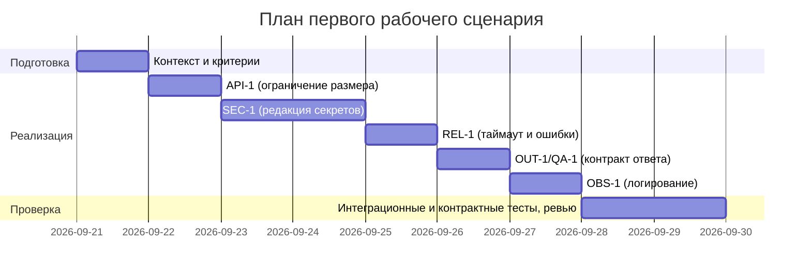

# План поставки

## Инкременты и ответственность

| Инкремент | Наблюдаемый результат | Что делает человек | Что делает AI или субагент | Проверка | Зависимости |
|---|---|---|---|---|---|
| 1 | При diff > 20000 символов возвращается HTTP 413 (API-1) | Формулирует границы и негативные кейсы (19999/20000/20001) | Генерирует шаблоны интеграционных тестов и фикстуры больших diff | Интеграционный: 20001 -> 413; Интеграционный: 19999 -> 200; E2E: клиент получает 413 с понятным сообщением | CONTEXT.md API-1; CASE.md |
| 2 | Перед вызовом LLM все секреты в diff заменены на [REDACTED] (SEC-1) | Утверждает список масок/паттернов | Предлагает паттерны и генерирует unit-тесты на редакцию | Unit: 'token=abc' -> '[REDACTED]'; Интеграция: построенный prompt не содержит 'abc' | CONTEXT.md SEC-1; API-1 |
| 3 | Внешний вызов LLM прерывается по таймауту 10 с; при ошибках возвращается контролируемый ответ без трасс-стека (REL-1) | Определяет контракт ошибок и временные бюджеты | Подсказывает обработку исключений и шаблоны ответов | Интеграция: заглушка спит 11 с -> контролируемый ответ; Unit: исключение провайдера -> нормализованный ответ | CONTEXT.md REL-1; SEC-1 |
| 4 | Ответ соответствует OUT-1: JSON с summary, risks[] (<=3: file,line,evidence,risk), checks; риски включаются только если подтверждены diff/правилом (QA-1) | Утверждает JSON-схему | Генерирует контрактные тесты | Контракт: валидация схемы; Негатив: 4-й риск отбрасывается; Позитив: риски содержат evidence из diff | CONTEXT.md OUT-1; QA-1; REL-1; SCOPE-1 |
| 5 | Логи содержат только request_id, длительность и статус; diff/ответ LLM не логируются (OBS-1) | Определяет формат логов | Генерирует конфигурацию фильтрации и unit‑тесты | Unit: запись логов содержит только разрешённые поля; Интеграция: при включённом verbose нет утечек diff/ответа | CONTEXT.md OBS-1; REL-1 |

## Диаграмма Ганта

## Как использовали AI

- Для чего: аудит плана по CoVe, конкретизация инкрементов и критериев приёмки, генерация черновиков тестов и масок
- Тип промпта: critique/CoVe
- Строка в practices/practice_02/prompts.md: P2-CoVe-01
- Что проверили и исправили сами: трассировка на SEC-1, API-1, REL-1, OUT-1, QA-1, OBS-1; измеримость проверок; согласование диаграммы Ганта с зависимостями
