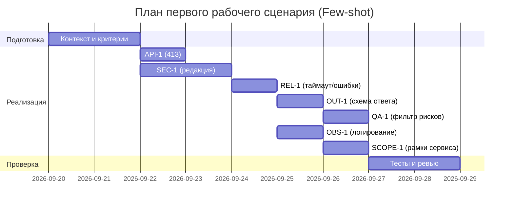

# План поставки

## Инкременты и ответственность

| Инкремент | Наблюдаемый результат | Что делает человек | Что делает AI/субагент | Проверка (тип и критерий) | Зависимости |
|---|---|---|---|---|---|
| 1 | API-1: HTTP 413 при diff > 20000 символов, 200 иначе | Уточняет порог и граничные случаи; утверждает обработку ответа | Генерирует набор граничных входов (19999, 20000, 20001) и сценарии e2e | Integration: diff длиной 20001 → 413; 19999 → 200. Contract: при 20000 ровно — 200. Acceptance: 413 для >20000, 200 иначе | CASE.md API-1 |
| 2 | SEC-1: Редакция секретов до внешнего LLM-вызова | Утверждает перечень масок; проводит код-ревью | Предлагает regex-паттерны (например, `ghp_[A-Za-z0-9]{36}`, `AKIA[0-9A-Z]{16}`) и тестовые diff | Unit: вход с токеном `ghp_xxx…` → на выходе `[REDACTED]`. Integration: при наличии секрета в diff — prompt к LLM не содержит секретов (лог через stub). Acceptance: 100% обнаруженных по перечню секретов редактируются | CASE.md SEC-1 |
| 3 | REL-1: Таймаут внешнего LLM 10 секунд, контролируемые ошибки | Определяет формат ошибок; настраивает таймаут и retry-политику без расширения scope | Генерирует негативные тесты (провайдер отвечает >10с, сетевые ошибки) | Integration: при задержке 11с → контролируемый ответ `{status:"timeout"}`; при 5с → 200 с данными. Contract: ошибки сети → `{status:"error", code:"LLM_UNAVAILABLE"}` | CASE.md REL-1 |
| 4 | OUT-1: Строгая схема ответа (summary, ≤3 risks, checks) | Утверждает JSON-схему и сериализацию | Генерирует контрактные тесты на схему и ограничения | Contract: ответ соответствует схеме (наличие `summary`, `checks[]`, `risks[]` ≤3, поля `file,line,evidence,risk` у каждого риска). Unit: при 4 рисках → в ответе ровно 3 (обрезка) | CASE.md OUT-1 |
| 5 | QA-1: В ответ включаются только подтверждённые риски | Определяет правило фильтрации; проверяет привязку к строкам diff | Генерирует тесты с ложным риском без evidence и с правильным evidence | Unit: риск без `evidence` или без ссылки на строку diff → исключён; риск со ссылкой на diff-строку → включён. Acceptance: доля неподтверждённых рисков в ответе 0% | CASE.md QA-1, OUT-1 |
| 6 | OBS-1: Логирование только `request_id`, длительность и статус | Определяет формат логов; проверяет отсутствие содержимого diff и ответа модели | Предлагает санитайзер для логов и тест кейсы | Integration: перехват логов запроса → нет подстрок из diff и текста модели; присутствуют `request_id`, `duration_ms`, `status`. Acceptance: утечки содержимого 0 | CASE.md OBS-1 |
| 7 | SCOPE-1: Сервис только советует; не пишет код и не действует в GitHub | Утверждает границы и отключает любые экшен-клиенты | Генерирует негативные тесты на вызовы GitHub API и генерацию патчей | Contract: отсутствие вызовов GitHub API-клиента в первом сценарии; Unit: ответы не содержат директив типа `approve/merge` и не включают diff-патчи. Acceptance: ни один путь выполнения не выходит за рамки советов | CASE.md SCOPE-1, OUT-1 |

## Диаграмма Ганта

## Как использовали AI

- Для чего: разложить работу на инкременты и проверяемые проверки; согласовать зависимости и Гант
- Тип промпта: few-shot
- Строка в `prompts.md`: Few-shot [prompts.md:13]
- Что проверили и исправили сами: соответствие SEC-1/API-1/REL-1/OUT-1/QA-1/OBS-1/SCOPE-1; отказ от нефокусных улучшений вне первого сценария
