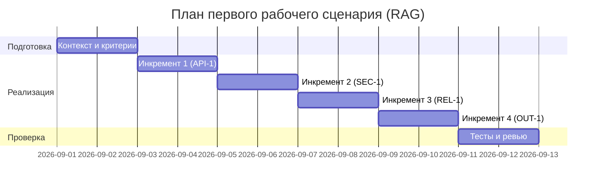

# План поставки (RAG-исправление)

## Инкременты и ответственность

| Инкремент | Наблюдаемый результат | Что делает человек | Что делает AI или субагент | Проверка | Зависимости |
|---|---|---|---|---|---|
| 1 | Ограничение длины diff и HTTP 413 | Формулирует критерий порога | Предлагает тестовые случаи | Интеграционные и e2e тесты; трассировка на API-1 [CASE.md:64-66] [context.md:17-19] | Базовый контекст |
| 2 | Редакция секретов (SEC-1) | Определяет маски | Генерирует паттерны и тесты | Юнит и e2e; подтверждение по QA-1 [CASE.md:64,69] [context.md:17,22] | После 1 |
| 3 | Таймаут LLM 10с и контролируемые ошибки (REL-1) | Определяет формат ошибок | Подсказывает обработку исключений | Интеграционные тесты; трассировка на REL-1 [CASE.md:66] [context.md:19] | После 2 |
| 4 | Формат OUT-1 (JSON: summary, risks[], checks[]) | Утверждает схему | Генерирует контрактные тесты | Контрактные тесты; трассировка на OUT-1 [CASE.md:67] [context.md:20-21] | После 3 |

Примечание: соблюдаются границы SCOPE-1 — сервис только советует; он не пишет код и не выполняет действия в GitHub [CASE.md:68] [context.md:21,35]. Логи соответствуют OBS-1: пишем только request_id, длительность и статус [CASE.md:70] [context.md:23].

### Трассировка правил

- SEC-1: редакция секретов до внешнего LLM [CASE.md:64] [context.md:17].
- API-1: diff > 20000 символов — HTTP 413 [CASE.md:65] [context.md:18].
- REL-1: timeout 10 секунд; ошибки нормализуются [CASE.md:66] [context.md:19].
- OUT-1: результат содержит summary, risks (<=3: file, line, evidence, risk), checks [CASE.md:67] [context.md:20-21].
- SCOPE-1: только рекомендации, без действий в GitHub [CASE.md:68] [context.md:21,35].
- QA-1: риски включаем только при подтверждении diff или правилом [CASE.md:69] [context.md:22].
- OBS-1: логируем только request_id, длительность и статус; не логировать diff и ответы модели [CASE.md:70] [context.md:23].

## Диаграмма Ганта

Диаграмма согласована с зависимостями инкрементов и проверками; критерии проверки сформулированы воспроизводимо и трассируются к правилам [CASE.md:95-103].

## Проверки (детально)

1. API-1: длина diff
   - Вход: строка `diff` > 20000 символов.
   - Шаги: отправить запрос в `/api/reviews` с `payload.diff` длиной > 20000.
   - Ожидание: HTTP 413.
   - Критерий успешности: реализован отказ при превышении порога [CASE.md:65] [context.md:18].

2. SEC-1: редакция секретов в prompt
   - Вход: `diff` со строкой, имитирующей секрет (например, `token=ABC123`).
   - Шаги: вызвать `review_service.review(diff)`; проверить сформированный prompt, куда передаётся diff.
   - Ожидание: секреты заменены на `[REDACTED]` перед отправкой во внешний LLM.
   - Критерий успешности: в prompt отсутствуют исходные секреты; подтверждено ссылкой на место формирования prompt [TRAINING_PR.diff:19-22] и правилом [CASE.md:64] [context.md:17].

3. REL-1: таймаут и контролируемая ошибка
   - Вход: имитация LLM, отвечающего дольше 10 секунд.
   - Шаги: зависание `llm.generate()` >10с; перехват ошибки и возвращение контролируемого ответа.
   - Ожидание: нормализованный ответ ошибки согласно политике REL-1.
   - Критерий успешности: таймаут 10с соблюдён; ошибка преобразована [CASE.md:66] [context.md:19].

4. OUT-1: формат ответа
   - Вход: валидный `diff`.
   - Шаги: вызвать `/api/reviews`.
   - Ожидание: JSON содержит `summary`, `risks[]` (<=3, элементы: file, line, evidence, risk), `checks[]`.
   - Критерий успешности: структура соответствует OUT-1 [CASE.md:67] [context.md:20-21].

5. QA-1: подтверждение рисков
   - Вход: вывод с рисками.
   - Шаги: для каждого риска проверить наличие ссылки на конкретную строку diff или правило.
   - Ожидание: риски без подтверждения исключаются.
   - Критерий успешности: соблюдение QA-1 [CASE.md:69]; примеры подтверждения — места использования diff в коде [TRAINING_PR.diff:19-22,35-37].

6. OBS-1: логирование
   - Вход: включённые логи сервиса.
   - Шаги: проверить, что в логах пишутся только `request_id`, длительность и статус.
   - Ожидание: отсутствуют записи с содержимым diff и ответами модели.
   - Критерий успешности: соответствие OBS-1 [CASE.md:70] [context.md:23].

## Как использовали AI

- Для чего: разложить работу на инкременты и проверки под правила SEC-1/API-1/REL-1/OUT-1/QA-1/OBS-1 [CASE.md:64-71].
- Тип промпта: master prompt [CASE.md:35-46].
- Строка в [`prompts.md`](../prompts.md): P2-CoVe-01 [prompts.md:3-10].
- Что проверили и исправили сами: увязали проверки с правилами и diff; отклонили нефокусные предположения вне источников [CASE.md:72-76].

## Отклонённые как неподтверждённые

- Правила, не относящиеся к учебному PR (snake_case таблиц БД, i18n фронтенда) — не включены в Context Pack и план поставки [CASE.md:72-76].
- Любые предположения, не подтверждённые `CASE.md`/`context.md`/`TRAINING_PR.diff` — отклонены, согласно QA-1 [CASE.md:69].
