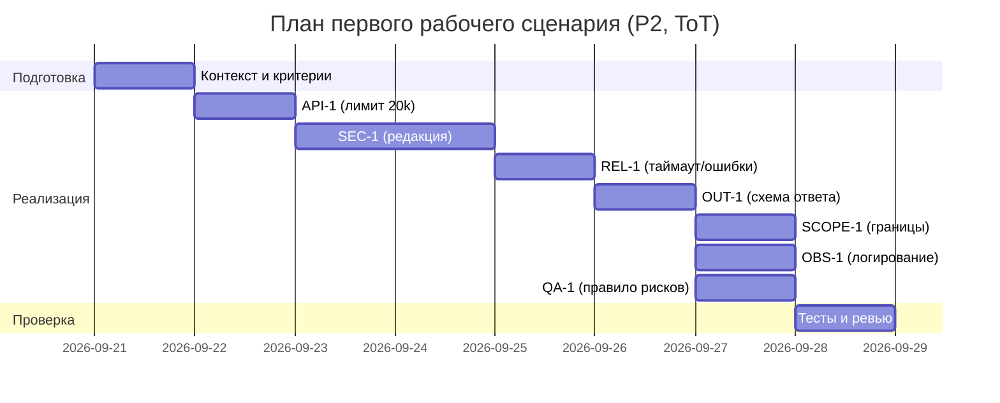

# План поставки (исправленный)

## Инкременты и ответственность

| Инкремент | Наблюдаемый результат | Что делает человек | Что делает AI или субагент | Проверка (тип, условие -> ожидаемый исход) | Зависимости |
|---|---|---|---|---|---|
| 1 (API-1) | Дифф длиннее 20 000 символов отклоняется с HTTP 413 | Утверждает порог и формат ошибки | Предлагает граничные тест-кейсы | integration: diff=20001 -> 413; e2e: diff=19999 -> 200 OK | CONTEXT API-1 |
| 2 (SEC-1) | Из diff перед отправкой во внешний LLM вырезаны секреты | Уточняет маски и исключения | Генерирует паттерны и негативные примеры | unit: "token=abc" -> "[REDACTED]"; e2e: prompt к LLM не содержит секретов -> PASSED | 1 (для последовательности проверки потока) |
| 3 (REL-1) | Вызов LLM ограничен 10с, ошибки нормализованы | Определяет контракт ошибок | Предлагает обработку таймаутов | integration: провайдер >10с -> 504-like контролируемый JSON; unit: эмуляция Timeout -> код пути возврата | 2 (перед вызовом редактируем секреты) |
| 4 (OUT-1) | Ответ соответствует схеме: summary, risks[<=3:{file,line,evidence,risk}], checks[] | Утверждает схему | Генерирует контрактные тесты | contract: ответ валиден JSON-схеме; unit: сериализатор заполняет поля | 3 (зависит от обработки ошибок) |
| 5 (SCOPE-1) | Сервис только советует, без действий в GitHub/репо | Определяет границы | Проверяет формулировки ответов | contract: ни один эндпоинт не инициирует внешние действия; e2e: ответ содержит рекомендации, не команды на действие | 4 |
| 6 (OBS-1) | Логи содержат только request_id, длительность, статус | Настраивает политику логов | Подсказывает формат полей | unit: логгер не пишет diff/LLM-ответ; integration: по запросу -> в логе только {request_id,duration,status} | 4 |
| 7 (QA-1) | Риски включаются только если подтверждены diff или правилом | Формализует критерии включения | Предлагает тестовые наборы | unit: diff без подтверждений -> risks=[]; unit: diff с явным нарушением SEC-1 -> risk присутствует; contract: не более 3 рисков | 4 |

Примечание по трассировке: каждый инкремент явно привязан к правилу из Context Pack — SEC-1, API-1, REL-1, OUT-1, SCOPE-1, QA-1, OBS-1 (см. CONTEXT.md). Проверки измеримы, имеют условия и ожидаемые исходы, и соотносятся с соответствующим правилом.

## Диаграмма Ганта

Длительности и зависимости согласованы с таблицей инкрементов: сначала базовый поток (API-1 -> SEC-1 -> REL-1 -> OUT-1), затем уточняющие политики (SCOPE-1, OBS-1, QA-1) и общий цикл проверки.

## Как использовали AI

- Для чего: разложить работу на инкременты с полной трассировкой правил и измеримыми проверками, согласовать зависимости и Гант
- Тип промпта: Tree of Thoughts
- Строка в `prompts.md`: P2-ToT
- Что проверили и исправили сами: верифицировали трассировку SEC-1/API-1/REL-1/OUT-1/QA-1/OBS-1/SCOPE-1; уточнили условия и исходы тестов; согласовали зависимости и диаграмму Ганта
